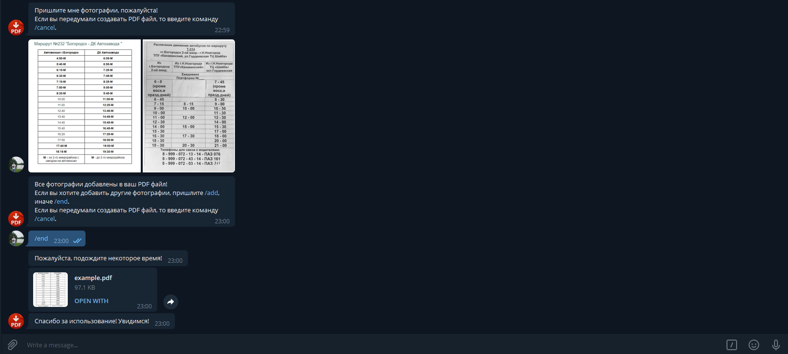

## **Description**

This bot creates a PDF file from photos that the user will send to it.

## **Install**
+ Install dependencies from file `requirements.txt`:
  
  `pip install -r requirements.txt`
  

+ insert your unique bot token (get it from [Bot father](https://t.me/botfather)) into `TOKEN` variable:
  
    `TOKEN = "your_token"`

+ run `server.py`:

    `python server.py`

## **Example**

